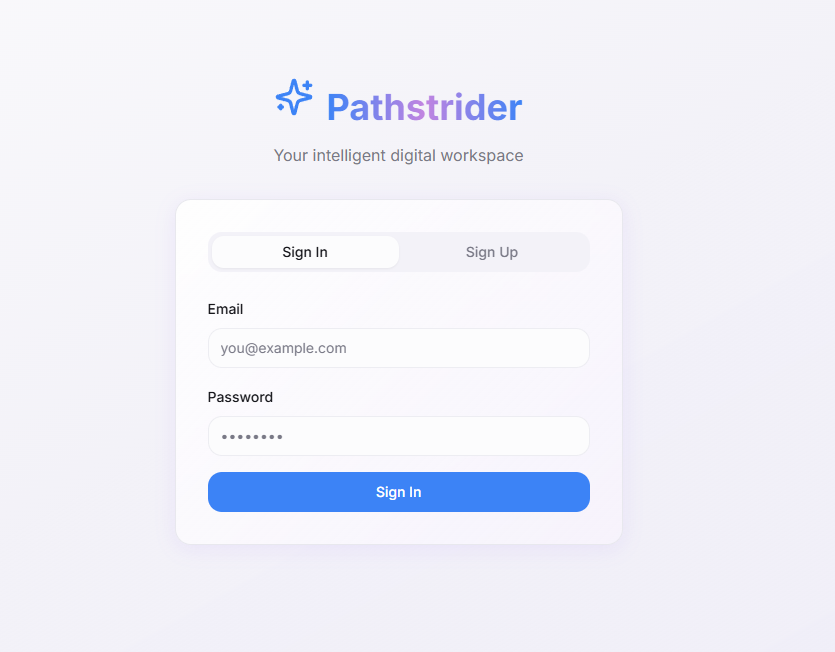
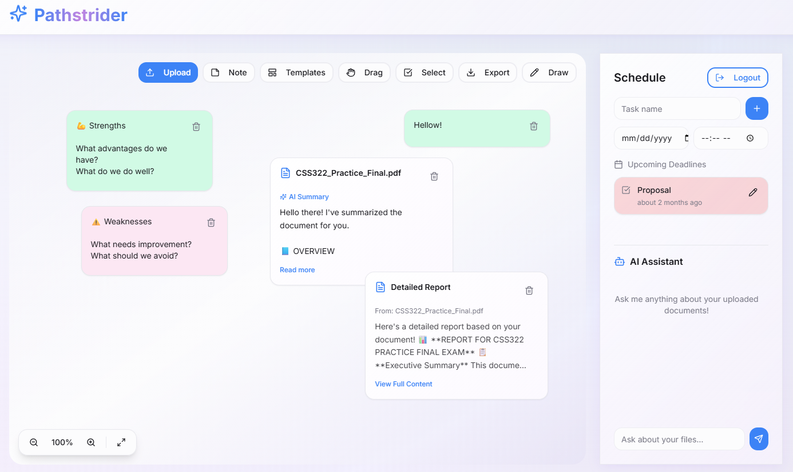

# Pathstrider

Pathstrider is a conceptual project developed using Lovable, focusing on
user flow, system structure, and interaction logic rather than raw code
implementation.

## What is it?
Pathstrider is a huge whiteboard. That allows users to put data in as much as they want.
Whether it is a PDF file, notes, or a drawing, so users can organize their data/files.
It comes with an AI Assistant allow users to be able to analyze data within the board itself.
Essentially, turning your screentime into a digital working space, rather than a physical one.

## Live Project
🔗 [Here Is The Published Link](https://pathstrider-mindscape-24551.lovable.app)

### Login View

### Main View

## Project Goal
- Explore structured progression systems
- Design clear user flows
- Practice platform-based development constraints

## Tools & Platform
- Lovable (no direct source code export)
- System design & UX logic
- Iterative prototyping

## My Contribution
- Project concept & structure
- Flow design and logic
- UI/interaction decisions

## Notes
This project was built on a no-code/low-code platform, therefore the
source code is not directly accessible.

